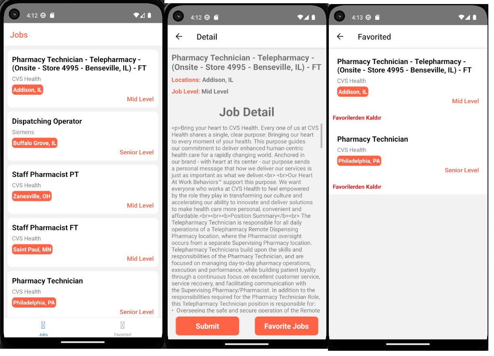

# React Native Patika Job Search App

The project is a mobile application that allows users to search for jobs. The application fetches job data from an API and displays it to the user. The user can search for jobs by entering a keyword in the search bar. The application also allows users to view the details of a job by clicking on a job card. The application is built using React Native and Redux Toolkit.


## Features
- Users can search for jobs by entering a keyword in the search bar.
- Users can view the details of a job by clicking on a job card.
- Users can view the job title, company name, location, and job description.
- Users can view the job's requirements and benefits.
- Users can view the job's application link.


## Screenshots




## Installation

To run the Todo app on your local machine, you need to have Node.js and npm installed. You also need to have an Android or iOS emulator installed on your computer or a physical device connected to your computer. Follow these steps to install and run the application:

1. Clone the repository:

   ```bash
   git clone https://github.com/yusufie/react-native-patika-job-search.git
    ```

2. Navigate to the project directory:

   ```bash
   cd react-native-patika-job-search
   ```

3. Install the dependencies:

   ```bash
    npm install
    ```

4. Run the development server:

   ```bash
   npm run start
   ```

6. Run the application on an emulator or a physical device:

   ```bash
   npm run android
   ```

   or

   ```bash
   npm run ios
   ```

Open the emulator or connect your physical device to your computer to run the application. The application will be automatically installed and launched on the device.


## Contributing

Contributions are welcome! If you find any issues or have suggestions for improvements, please open an issue or submit a pull request. Follow these steps to contribute:

1. Fork the repository.
2. Create a new branch for your feature or bug fix.
3. Make the necessary changes and commit those changes.
4. Push your code to your forked repository.
5. Submit a pull request describing the changes you made.

Please make sure to follow the existing code style and conventions.